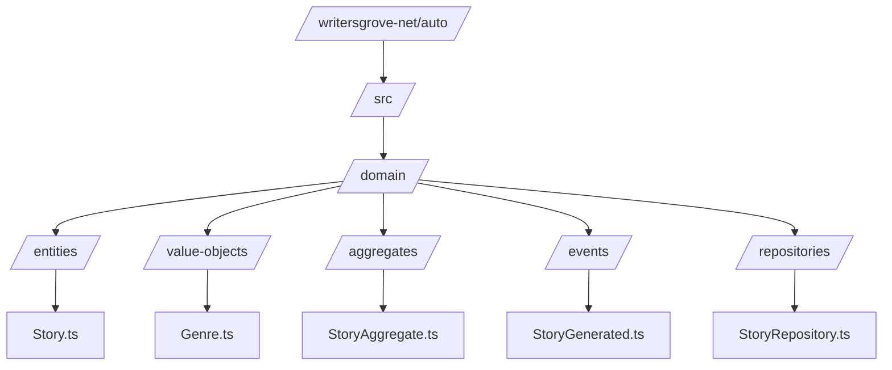
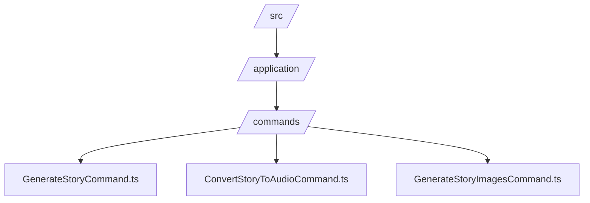
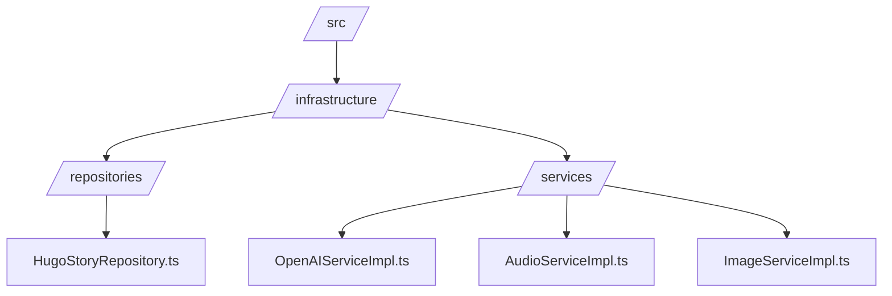
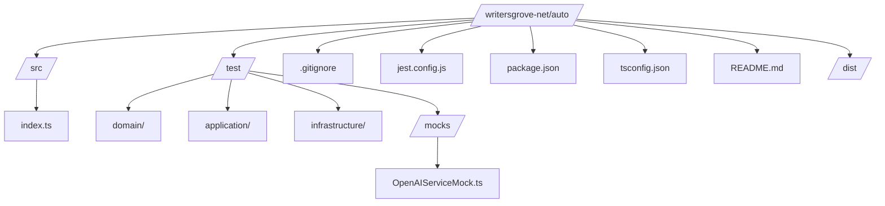

# Writers Grove

## Project Requirements

- Typescript
- Jest Testing Framework
- Domain Driven Architecture

## Project Phases

- Todo

  - [ ] Setup SQLite Database
  - [ ] Setup Frontend Hugo Blog
  - [ ] Real Cronjob
  - [ ] Random Genre from Array
  - [ ] Use Open AI to generate a json object that includes a story, title, synopsis, and keywords
  - [ ] Save generated story to DB
  - [ ] Generate pictures from story
  - [ ] Resize Images
  - [ ] Convert images to WebP
  - [ ] Save images to S3 CDN
  - [ ] Generate audio from story
  - [ ] Save story to S3 CDN
  - [ ] Generate Hugo Blogpost from saved story
  - [ ] Configure Github Workflow to push hugo blog to S3
  - [ ] Publish the post by triggering a github commit
  - [ ] Upload to Podcasts
  - [ ] Generate Video from images and audio
  - [ ] Upload Video to youtube

## Project Structure

### Mono Repo

This will be a mono repo that has both the auto story generation and the Hugo blog in a single repository.

I will use the github workflows to detect changes in each folder of the project to determine which set of workflows to run.

### Auto Story Generator Design

### Domain

### Commands

### Infrastructure

### Tests and other files

