# Writers Grove

## Project Requirements

- The project is in Typescript
- The Project will use Jest for Testing
- The project will use clean code best practices with clear names avoiding names like utility and always selecting meaningful names
- The project will be domain driven so the story which is the main part of phase 1 will have save, and generate functions built right into it so we can just call them
- We will use dotenv, OpenAI's api library, and youtube api

## Project Phases

- Phase 1: Text
  - A real cronjob on a linux server will run (not a fake javascript one) every hour and start the process
  - A random genre from an array list will be selected and passed in to the generator when it is ran
  - The system will reach out to Open AI to generate a json object that includes a story, title, synopsis, and keywords
  - The system will take the returned story and populate it into a template for a Hugo Markdown blog post
  - The system will then publish the post by triggering a github commit and push which will have github handle the rest
  - Phase 2 action will be triggered
- Phase 2: Audio
  - The story will be sent to OpenAI's text to speech translator
  - The audio will be uploaded to an s3 bucket and also uploaded as a podcast to youtube
  - Phase 3 action will triggered
- Phase 3: Video
  - The story will have 5 images generated from OpenAI
  - The story will then use ffmpeg to creeate a video with the audio and images
  - The video will be uplaoded to youtube

## Project Structure

### Mono Repo

This will be a mono repo that has both the auto story generation and the Hugo blog in a single repository.

I will use the github workflows to detect changes in each folder of the project to determine which set of workflows to run.

### Auto Story Generator

```mermaid
graph TD
    A[/writersgrove-net/auto/]
    A --> B[/src/]
    B --> C[/domain/]
    C --> D[/entities/]
    D --> E[Story.ts]
    C --> F[/value-objects/]
    F --> G[Genre.ts]
    C --> H[/aggregates/]
    H --> I[StoryAggregate.ts]
    C --> J[/events/]
    J --> K[StoryGenerated.ts]
    C --> L[/repositories/]
    L --> M[StoryRepository.ts]

    B --> N[/application/]
    N --> O[/commands/]
    O --> P[GenerateStoryCommand.ts]
    O --> Q[ConvertStoryToAudioCommand.ts]
    O --> R[GenerateStoryImagesCommand.ts]

    B --> S[/infrastructure/]
    S --> T[/repositories/]
    T --> U[HugoStoryRepository.ts]
    S --> V[/services/]
    V --> W[OpenAIServiceImpl.ts]
    V --> X[AudioServiceImpl.ts]
    V --> Y[ImageServiceImpl.ts]

    B --> Z[/config/]
    Z --> AA[config.ts]

    B --> AB[index.ts]

    A --> AC[/test/]
    AC --> AD[domain/]
    AC --> AE[application/]
    AC --> AF[infrastructure/]
    AC --> AG[/mocks/]
    AG --> AH[OpenAIServiceMock.ts]

    A --> AI[.gitignore]
    A --> AJ[jest.config.js]
    A --> AK[package.json]
    A --> AL[tsconfig.json]
    A --> AM[README.md]

```

